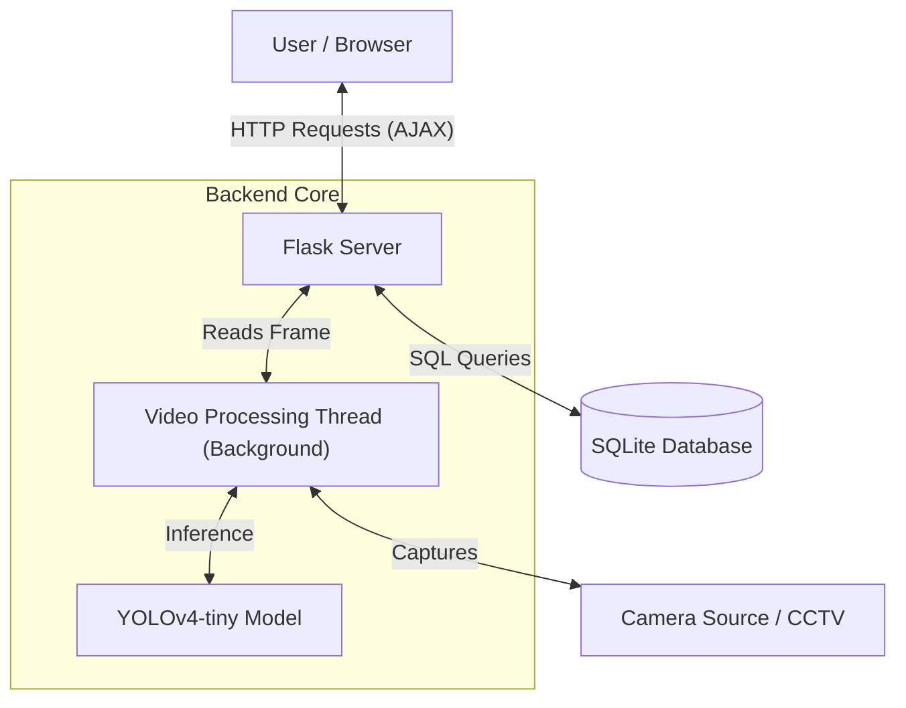
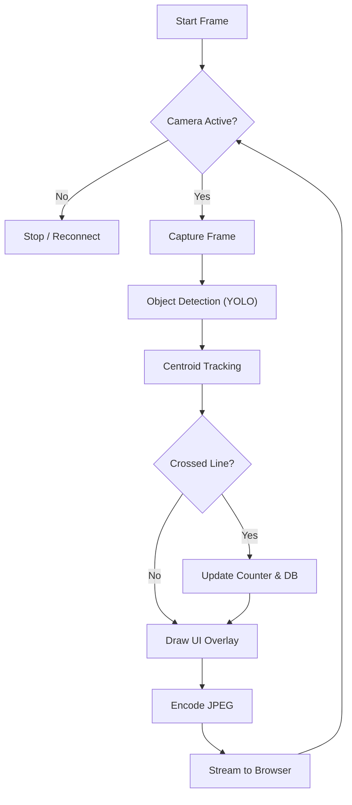
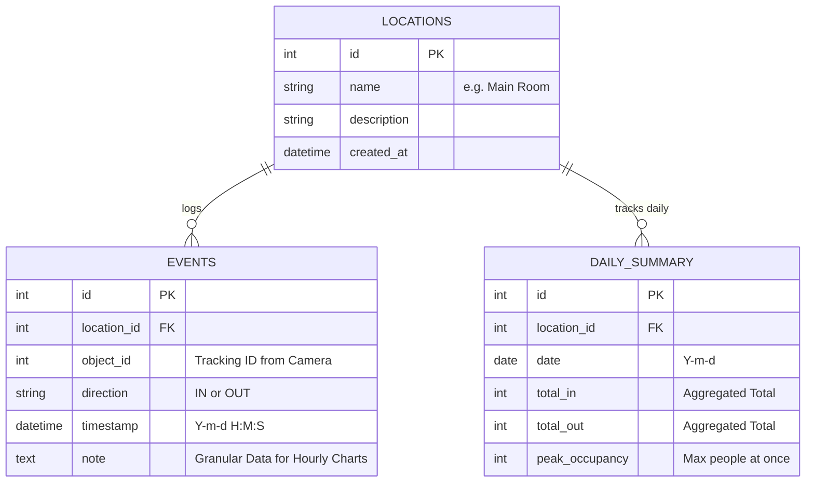

# 📊 Smart People Counter & Analytics Dashboard

> **A Production-Ready AI System for Real-time Crowd Monitoring**
> *Powered by YOLOv4, Flask, and Responsive Charts*

## 📖 Ringkasan Project
Aplikasi ini adalah sistem penghitung pengunjung cerdas yang menggabungkan kekuatan **Computer Vision** (AI) dengan **Web Dashboard** modern. Sistem ini mampu mendeteksi manusia secara real-time dari feed kamera CCTV atau webcam, melacak pergerakan mereka (masuk/keluar), dan menyajikan statistik analitik melalui antarmuka website yang interaktif dan responsif.

---

## 🔬 Penjelasan Ilmiah (The Science Behind It)

Aplikasi ini menerapkan beberapa konsep utama dalam bidang Computer Vision dan Data Engineering:

### 1. Object Detection (YOLOv4-tiny)
Kami menggunakan algoritma **YOLO (You Only Look Once)**, spesifiknya versi *tiny* untuk performa maksimal pada CPU.
*   **Cara Kerja**: Citra dibagi menjadi grid. Neural Network memprediksi *bounding box* dan probabilitas kelas (Person) untuk setiap grid secara simultan.
*   **Keunggulan**: Sangat cepat (real-time) dibandingkan algoritma R-CNN tradisional.

### 2. Object Tracking (Centroid Tracking)
Deteksi objek hanya terjadi per-frame. Untuk mengetahui bahwa orang di frame ke-10 adalah orang yang sama di frame ke-11, kami menggunakan algoritma **Centroid Tracking**.
*   **Logika**: Menghitung titik tengah (centroid) dari setiap bounding box.
*   **Euclidean Distance**: Sistem menghitung jarak antara centroid baru dan lama. Jika jaraknya dekat, ID yang sama dipertahankan. Inilah yang memungkinkan sistem "mengingat" identitas objek.

### 3. Vector Cross Product & Line Crossing
Untuk menghitung "Masuk" atau "Keluar", sistem tidak hanya melihat posisi, tapi **vektor pergerakan**:
*   Sebuah garis virtual ditarik di tengah layar.
*   Sistem memantau perubahan koordinat centroid (Y-axis) relatif terhadap garis ini.
*   Ketika centroid berpindah dari sisi positif ke negatif (atau sebaliknya) melewati garis, event `IN` atau `OUT` dicatatkan.

---

## 📐 Arsitektur & Alur Kerja

### System Architecture
Diagram ini menunjukkan bagaimana komponen Front-End (Browser), Back-End (Flask), AI (YOLO), dan Database berinteraksi.



### Flow Logic (Alur Deteksi)
Langkah-langkah yang terjadi dalam setiap frame video untuk menghitung pengunjung:



---

## 🗄️ Desain Database (ERD)

Sistem ini menggunakan **SQLite** dengan pendekatan *Granular Event Logging* untuk akurasi data real-time.



*   **Tabel `events`**: Mencatat setiap detik seseorang lewat. Ini memungkinkan kita membuat **Day Chart** yang update setiap detik.
*   **Tabel `daily_summary`**: Menyimpan rekapitulasi untuk performa kueri jangka panjang (Bulanan/Tahunan).

---

## ✨ Fitur Utama

### 🧠 **Intelligent Core**
*   **Auto-Recovery**: Kamera otomatis reconnect jika sinyal hilang.
*   **Background Processing**: Pemrosesan video berjalan di thread terpisah, sehingga tidak akan berhenti meskipun tab browser di-minimize.
*   **Graceful Shutdown**: Menutup koneksi database dan kamera dengan aman saat aplikasi dimatikan.

### 📊 **Premium Dashboard**
*   **Real-time Interactivity**: Grafik Day Chart update otomatis (polling 1 detik) tanpa refresh halaman.
*   **Multi-Chart**:
    *   **Day Chart**: Traffic per jam (00-24).
    *   **Monthly Chart**: Kalender heatmap pengunjung harian.
    *   **Pie Chart**: Proporsi visitor Masuk vs Keluar.
*   **Camera Switcher**: Ganti sumber kamera (Webcam/CCTV) langsung dari UI.

---

## 🚀 Panduan Instalasi

### 1️⃣ Persiapan
Pastikan Python 3.9+ sudah terinstall.

```bash
# 1. Clone Repository
git clone <repo-url>
cd people-counter/python-counter

# 2. Buat Virtual Environment
python3 -m venv venv
source venv/bin/activate  # Linux/Mac
# venv\Scripts\activate   # Windows

# 3. Install Dependencies
pip install -r requirements.txt
```

### 2️⃣ Model YOLO
Pastikan file weights ada di folder `models/`:
*   `yolov4-tiny.weights`
*   `yolov4-tiny.cfg`
*   `coco.names`

---

## 🖥️ Cara Menggunakan

1.  **Jalankan Server**:
    ```bash
    python app.py
    ```

2.  **Buka Dashboard**:
    Akses `http://localhost:5000` di browser Anda.

3.  **Interaksi**:
    *   Pilih kamera dari dropdown.
    *   Lihat grafik bergerak saat orang terdeteksi.
    *   Gunakan menu navigasi untuk melihat laporan bulanan.

---

## 🛠️ Tech Stack
*   **Backend**: Flask (Python)
*   **Vision**: OpenCV, NumPy
*   **Database**: SQLite3
*   **Frontend**: HTML5, TailwindCSS, Chart.js
*   **Icons**: FontAwesome

---

**© 2025 Smart People Counter Project**. Built efficiently.
